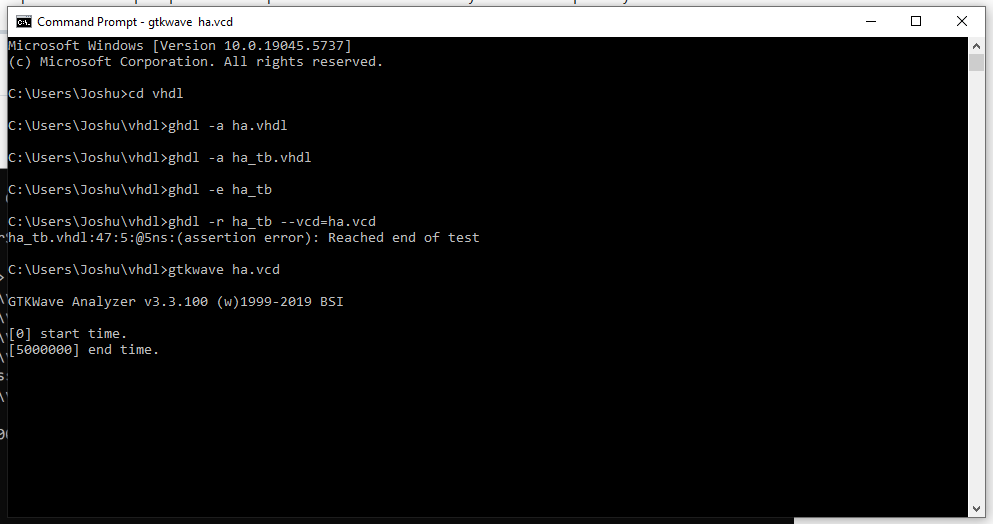
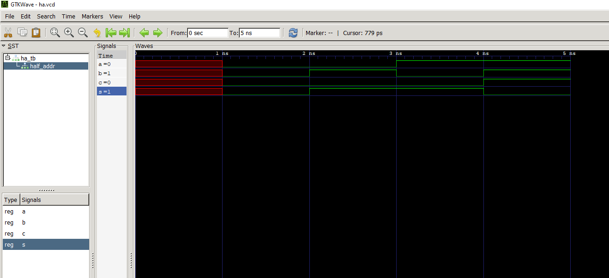
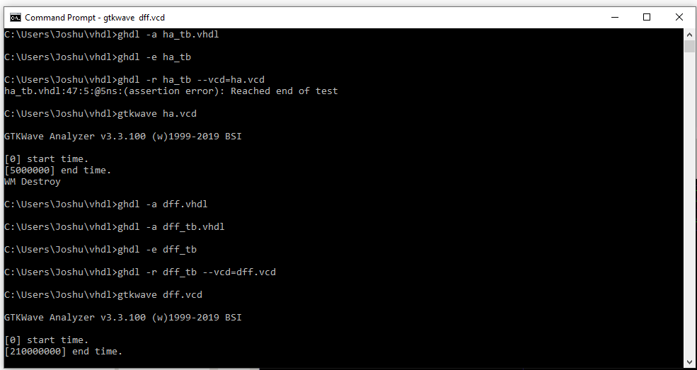
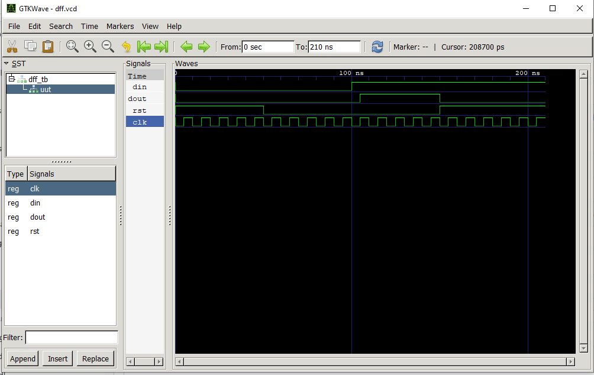

# CPE 322
## Lab 1: GHDL & GTKWave
### Instructions:
Go to the GitHub repository of Digital System Design (DSD)
Go to the GHDL folder
Install GHDL and GTKWave
Run the Half Adder example
Run another example such as D Flip-Flop or 4-to-1 Multiplexer
Document the results on your GitHub repository

---

## Half Adder
**Half Adder Code:**

**Half Adder Result:**

---
## D Flip Flop
**D Flip Flop Code:**

**D Flip Flop Result:**

---
## Summary
For this lab to work, I had to download gcc, gtkwave, ghdl and git. I also learned how to add varaibles to the system path through both the command terminal and through sysdm.cpl while I was getting the lab to work. In the lab I learned how to run VHDL files suing GHDL and then visualizing them through GTKWave so that I can see how they would work on an actual FPGA. GHDL is a free VHDL simulator that compiles and runs VHDL code, while GTKWave is a waveform viewer used to visualize digital signal traces (like VHDL/Verilog simulations). During the lab I was able to see how a half adder which adds two single-bit binary numbers and outputs a sum and a carry reacts to different inputs, the same thing with the D flip flop which stores one bit of data, capturing the input (D) at the clock edge and outputting it (Q) until the next clock cycle.

---
Author: Joshua Marino  
I pledge my honor that I have abided by the Stevens Honor System.
