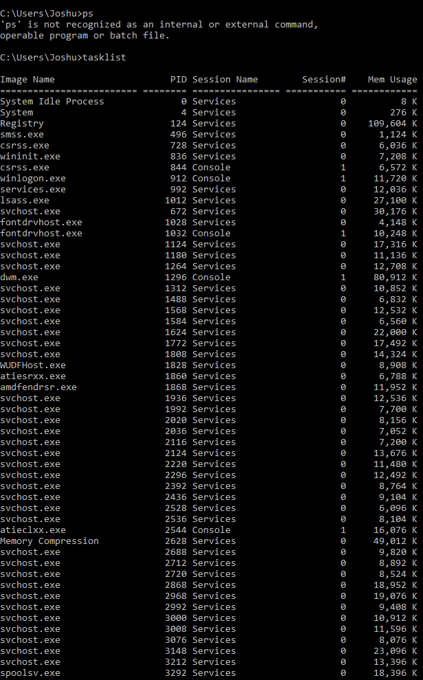
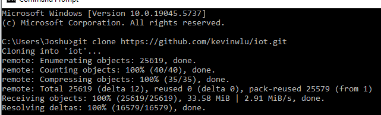

# CPE 322
## Lab 2: Command Line
### Instructions:

---

## Hostname

Displays the computer's network name

---

## set

Windows equivalent of env
Displays, sets, or removes environment variables in Windows CMD
---

## tasklist

Lists running processes
windows equivlant to ps
---

## cd

 Prints the current working directory 
 windows equivlant to pwd when typed with no arguements
---

## git clone https://github.com/kevinwlu/iot.git

Version control system for tracking code changes
Downloads the entire "iot" repository from GitHub to your local machine.

---

## cd iot

Navigates into the iot/ directory
---

## dir

Lists files/folders in the current directory 
windows version of ls

---

## df

 Displays disk space usage
 doesnt work on windows lol
---

## mkdir demo

Creates a new directory named "demo" in the current folder.

---

## cd demo

Navigates into the cd/ directory
---

## notepad file

Opens or creates file.txt in Notepad
windows version of nano
---

## type file.txt

 Displays the contents of file in the terminal
 windows equivalanet of cat
---

## copy file.txt file1

---

## move file.txt file2

Renames file to file2
windows equiv of mv
---

## del file2

---

## cls
I have no photo since it just clears the command prompt 
windows equiv of clear

---

## systeminfo

 Basic system data.
 man unname doesnt work on windows

---

## uname -a
Displays all system info (Linux/macOS only)
DOES NOT WORK ON WINDOWS can not get photo

---

## ipconfig

Displays network interface details
windows equiv of ifconfig
---

## ping localhost

Tests network connectivity to your own machine

---

## netstat

Displays network connections, routing tables, interface stats

---
## Summary
For this lab to work, I set up a deepseek instance on chrome and told it to tell me about the commands I was about to test, this was I could see if whether the commands were linux/mac only and could find windows equivlant ones fast. Deepseek was also able to explain to me what each one did which helped me better understand what these commands did along with actually testing them. I feel i have a better understanding of the command prompt. 

---
Author: Joshua Marino  
I pledge my honor that I have abided by the Stevens Honor System.

