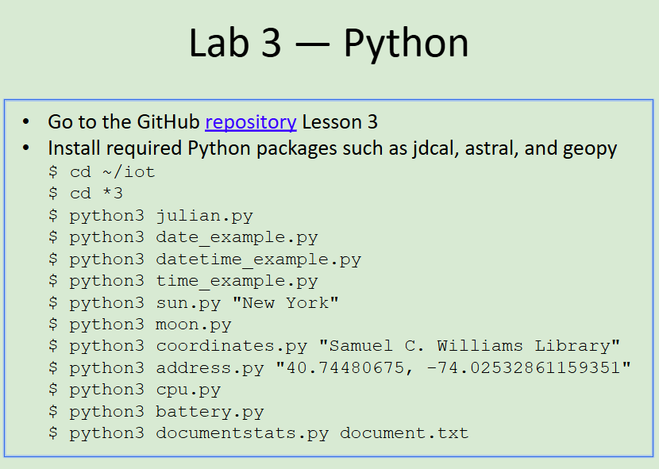
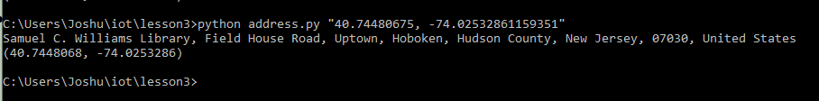

# CPE 322
## Lab 3: Python
### Instructions:

---

## julian.py

displays calendar date, julian calendar date and modified julian calendar date

---

## date_example

displays calendar date, day of the week,month, year, days after 1st day of class and days before end of classes
---

## datetime_example

give multiple different date time objects and displays them
---
time_example
## time_example

gives the day and time every ten seconds
---

## sun

give time zone, lat and long along with the times of dawn, sunrise,noon, sunset and dusk of the place taken in as arguement

---

## moon

gives the moon cycle for the next month
---

## coordinates

give coordinates of place taken in as arguement
---

## address

 gives the address of the coordinates taken in as arguement
---

## cpu

gives number of cores,number of logical cpus and utilization per second of each cpu
 
---

## battery

prints current battery statistics I am on a PC so it printed none

---

## documentstats

gives top words used in a document

---

## Summary
For this lab to work, I had to download python and additional python packages so the code would work. When installing python windows had an auto redirect to the microsoft store for it rather than using the download directly from the website, so even after adding python to my path, I stil had to go to app settings and turn off the redirect in app execution aliases. Downloading the additionally packages was easy however it was as simple as making sure I had pip installed and then running python -m pip install jdcal astral geopy pytz psutil. 

---
Author: Joshua Marino  
I pledge my honor that I have abided by the Stevens Honor System.
